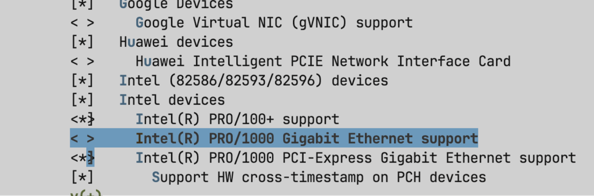
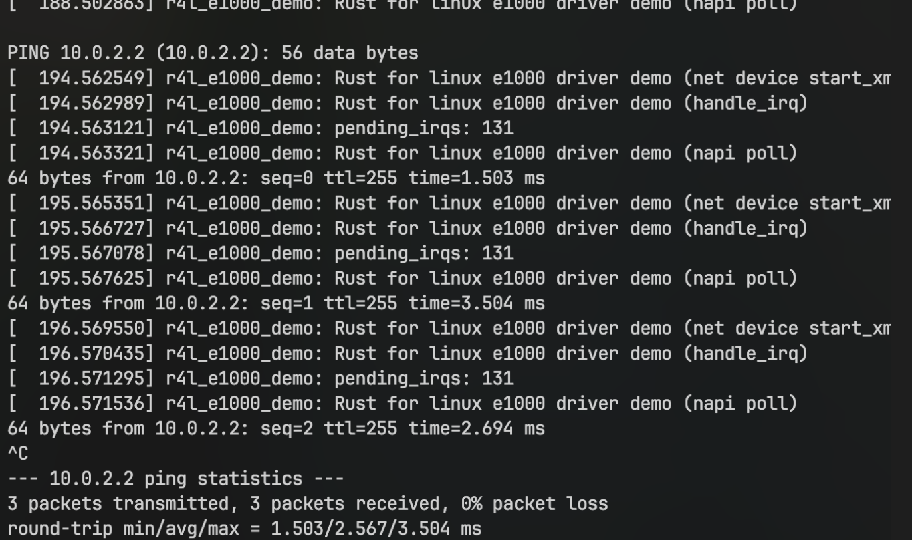

# Assignment 2

Q: 在该文件夹中调用make LLVM=1，该文件夹内的代码将编译成一个内核模块。请结合你学到的知识，回答以下两个问题：

1、编译成内核模块，是在哪个文件中以哪条语句定义的？

Kbuild 文件中 obj-m := r4l_e1000_demo.o 定义的, `obj-m`是编译成loadable module的意思

2、该模块位于独立的文件夹内，却能编译成Linux内核模块，这叫做out-of-tree module，请分析它是如何与内核代码产生联系的？

答：
因为makefile 里写了KDIR ?= ../linux, 这样能指定编译的内核目录为linux

禁用e1000 网卡

重新编译：
make LLVM=1

之后跑题目给的测试代码：
