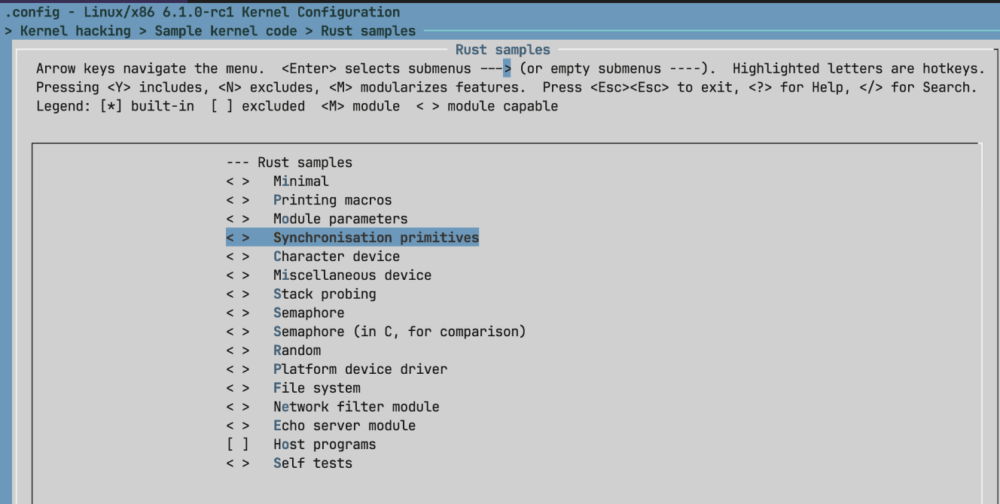
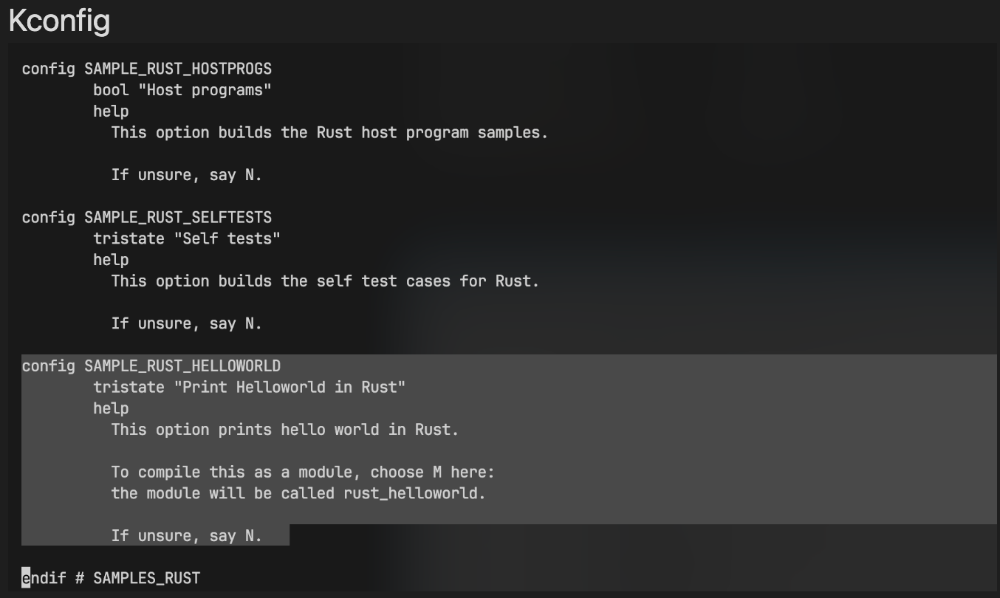
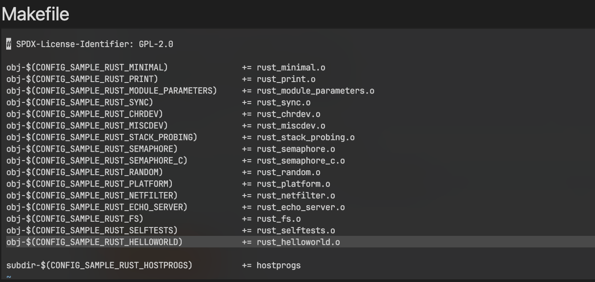
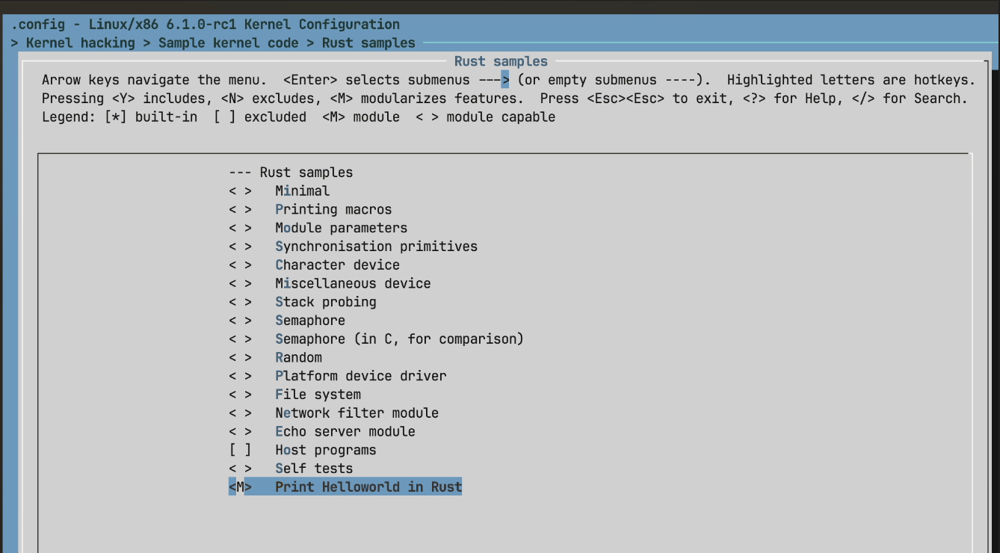
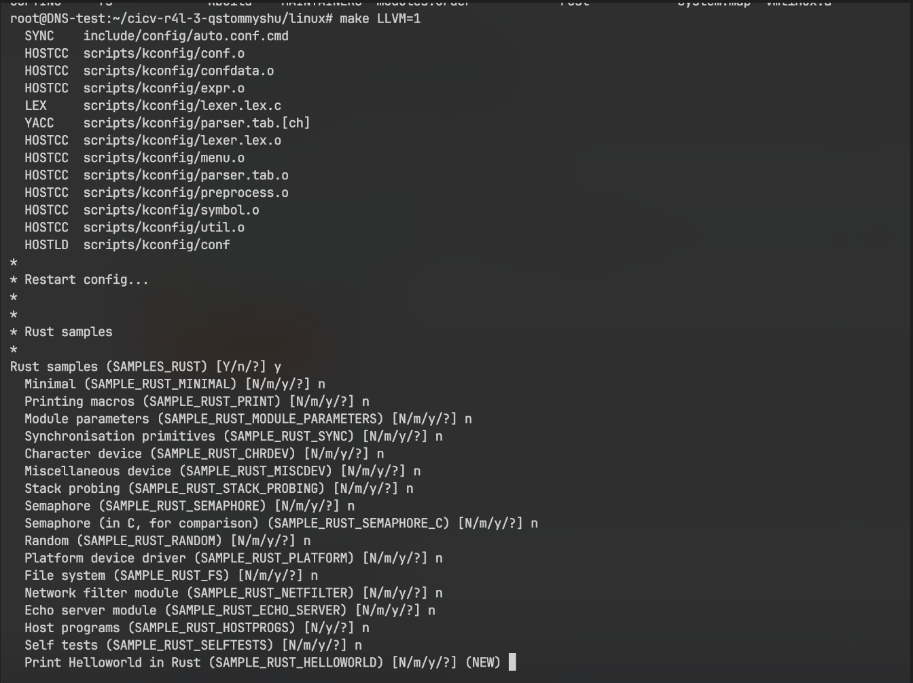
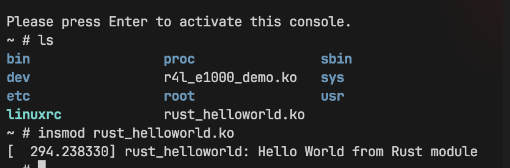

# Assignment 3

添加 Rust Sample 文件前：

添加 Rust Sample 文件，并对Kconfig 和 Makefile 文件做以下更改:

更改之后执行 `make LLVM=1 menuconfig`, 并将 `Print Helloworld in Rust` 加载成模块:

执行 `make LLVM=1` 重新编译

复制 rust_helloworld.ko 到编译的linux里, 并加载模块:
