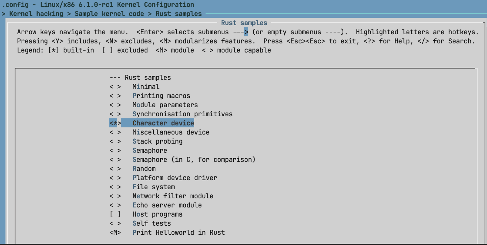
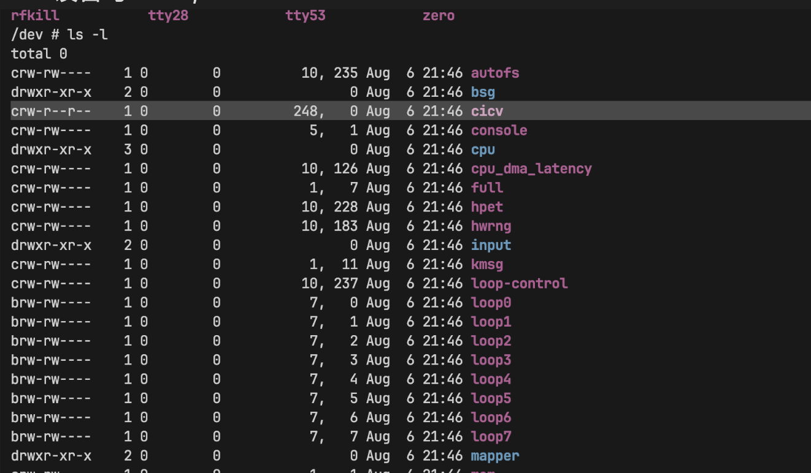
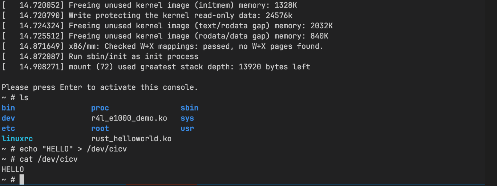

# Assignment 5

执行 `make LLVM=1 menuconfig` 更改配置:

Q：作业5中的字符设备/dev/cicv是怎么创建的？
答: R4L库里的代码创建的/dev/cicv
`struct RustChrdev {
    _dev: Pin<Box<chrdev::Registration<2>>>,
}
`

它的设备号是多少？

答: cicv 设备号:  248, 0

它是如何与我们写的字符设备驱动关联上的？
答: 创建字符设备的时候，/dev 下会生成一个设备文件，就是cicv, 这样就跟设备驱动关联上了

更改 `chrdev.rs` 文件后重新编译:

